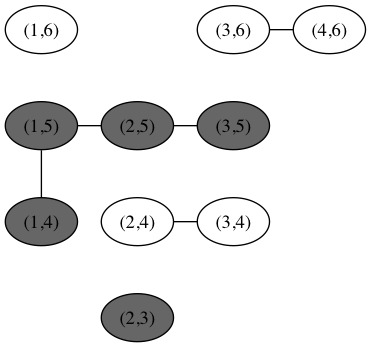

# Go Game written in Rust

Every few years, I re-write my Go game in another language. In 2014 it was [JavaScript](https://github.com/tlehman/go-websocket), in 2016 it was [Ruby](https://github.com/tlehman/goga.me), and in 2019 it is Rust, because OMG this language is amazing.

## Design decisions
Instead of separating the board and graph data structures, I am making a single graph with a node list 
and an edge list. Looping over those lists will still be fast, since the boards only go up to 19x19.

The `Graph` type should be able to render itself as [Graphviz](https://www.graphviz.org/).

When playing with others, we can connected two players through WebSocket, and do the validation of 
the move on the client side and the server side by compiling to WebAssembly on the client, and 
compilation to ordinary machine language on the server side. Both sides will use the same code, 
and all the code will be covered by Rust tests.

## Why Rust
It's fast, tooling is great, it compiles very nicely to [WebAssembly](https://webassembly.org/), 
which did not exist when I started writing Go Games.
